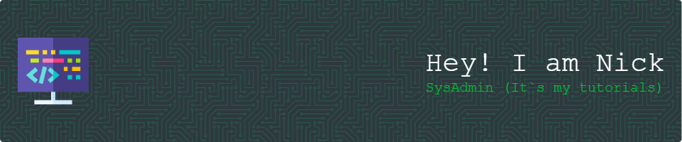

- 🌱 I’m currently learning SRE and DevOps
- 💞️ I’m looking to collaborate with other engineers
- 📫 Reach me by [Telegram](https://t.me/nickgud), [Email](mailto:goodnv@yandex.ru) 
- 📄 Know about my experiences [CV](https://cv.nickgud.ru/)

<!---

nickgud/nickgud is a ✨ special ✨ repository because its `README.md` (this file) appears on your GitHub profile.
You can click the Preview link to take a look at your changes.
--->

<h3 align="left">My Languages and Tools:</h3>

   
   
   
   
   
   

   <h3 align="left">Wiki:</h3>  
   
- ⚡ [Firefox](browser/shortcuts_firefox.md)  
- ⚡ [Vim](vim/vim.md)  
- ⚡ [Git](git/git.md)  
- ⚡ [Tmux](tmux/tmux.md)  
- ⚡ [SSH](/SSH.md)
- ⚡ [Windows](windows/win.md)  
